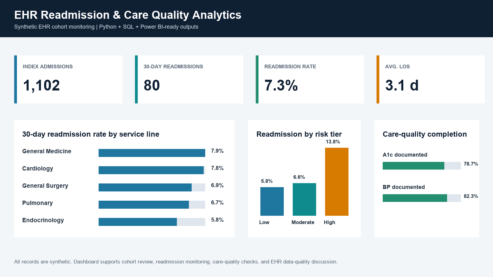

# EHR Readmission and Care Quality Analytics

[](https://github.com/tat1a/ehr-readmission-quality-analytics/actions/workflows/tests.yml)

Python, SQL, and Power BI portfolio project using a synthetic EHR-style dataset. The project demonstrates cohort construction, encounter-level feature engineering, readmission outcome logic, data-quality checks, and dashboard-ready reporting tables.

## Project Question

Among adult inpatient encounters in a synthetic EHR dataset, what operational and clinical factors are associated with 30-day readmission, and where are the main care-quality and data-quality gaps?

## What This Project Demonstrates

- EHR-style data modeling across patients, encounters, diagnoses, observations, and medications.
- SQL cohort logic for index admissions, readmission windows, chronic-condition flags, and quality checks.
- Python/pandas data generation, cleaning, feature engineering, aggregation, and validation.
- SQLite validation that rebuilds cohort-level outputs from raw EHR-style tables.
- Power BI-ready reporting tables for readmission monitoring and care-quality review.
- Power BI theme, semantic model, grouped DAX measures, build instructions, and static reference previews for the report pages.
- Responsible interpretation using synthetic data only.



Additional report previews:

- [Readmission Overview](assets/powerbi-page-1-readmission-overview.png)
- [Care Quality and Data Quality](assets/powerbi-page-2-quality-data.png)
- [Cohort Profile](assets/powerbi-page-3-cohort-profile.png)

## Headline Results

| Metric | Result |
| --- | ---: |
| Patients | 900 |
| Total encounters | 5,020 |
| Eligible index admissions | 1,102 |
| 30-day readmissions | 80 |
| Overall readmission rate | 7.3% |
| Average length of stay | 3.1 days |
| High-risk encounters | 130 |

The derived high-risk tier had a 13.8% readmission rate, compared with 6.6% in the moderate-risk tier and 5.8% in the low-risk tier. Documentation completion was 78.7% for A1c among diabetes encounters and 82.3% for blood-pressure documentation among hypertension encounters.

## Repository Structure

```text
.
├── .github/
│   └── workflows/
│       └── tests.yml
├── assets/
│   └── dashboard-preview.png
├── data/
│   ├── processed/
│   └── raw/
├── docs/
│   ├── DATA_DICTIONARY.md
│   ├── DATA_SOURCE_AND_VALIDATION.md
│   ├── DATA_MODEL.md
│   ├── METHODS.md
│   ├── POWERBI_BUILD_INSTRUCTIONS.md
│   ├── POWERBI_VISUAL_BUILD_GUIDE.md
│   ├── POWERBI_INTERACTIVE_SPEC.md
│   └── POWERBI_GUIDE.md
├── pipeline/
│   ├── 01_schema.sql
│   ├── 02_cohort_logic.sql
│   ├── 03_quality_checks.sql
│   ├── 04_sqlite_cohort_validation.sql
│   ├── create_powerbi_previews.py
│   ├── build_sqlite_database.py
│   ├── README.md
│   └── build_ehr_readmission_dataset.py
├── reports/
│   └── ANALYST_BRIEF.md
├── powerbi/
│   ├── README.md
│   ├── EHR_Readmission_Quality_Analytics.pbip
│   ├── EHR_Readmission_Quality_Analytics.Report/
│   ├── EHR_Readmission_Quality_Analytics.SemanticModel/
│   ├── measures.dax
│   └── theme-ehr-readmission.json
├── requirements.txt
└── tests/
    └── test_pipeline_outputs.py
```

## Run

```bash
pip install -r requirements.txt
python pipeline/build_ehr_readmission_dataset.py
python pipeline/build_sqlite_database.py
python pipeline/create_powerbi_previews.py
python -m unittest discover -s tests -v
```

The pipeline creates deterministic synthetic EHR records and dashboard-ready CSV tables in `data/processed/`. The SQLite validation script rebuilds the index-admission cohort from raw tables and exports `sql_validation_summary.csv`.

## Key Outputs

- `readmission_summary_by_service.csv`
- `risk_tier_summary.csv`
- `quality_measure_summary.csv`
- `feature_importance_proxy.csv`
- `data_quality_summary.csv`
- `operational_flag_summary.csv`
- `cohort_summary_by_age.csv`
- `cohort_summary_by_insurance.csv`
- `dashboard_kpis.csv`
- `sql_validation_summary.csv`
- `reports/ANALYST_BRIEF.md`

## Power BI

The Power BI project file is `powerbi/EHR_Readmission_Quality_Analytics.pbip`. It includes an embedded semantic model, grouped DAX measures, and three completed dashboard pages.

The `data/processed/` tables remain the reproducible reporting layer. `powerbi/measures.dax` contains the recommended slicer-responsive measures, `docs/POWERBI_VISUAL_BUILD_GUIDE.md` provides the exact visual field map, and `docs/POWERBI_INTERACTIVE_SPEC.md` defines slicers, interactions, formatting, and page structure. The static preview in `assets/dashboard-preview.png` shows the intended layout.

For step-by-step Power BI report construction, use `docs/POWERBI_VISUAL_BUILD_GUIDE.md` and the theme stored in `powerbi/theme-ehr-readmission.json`.

## Data Scope

All records are simulated. The project contains no real patient data, no PHI, no MIMIC-IV data, and no restricted clinical source data.

See `docs/DATA_SOURCE_AND_VALIDATION.md` for the data-source rationale, validation checks, and interpretation limits.

## Interpretation Boundary

This project is a reproducible analytics demonstration. It should not be interpreted as clinical evidence, a validated predictive model, or a measure of real-world readmission performance.

