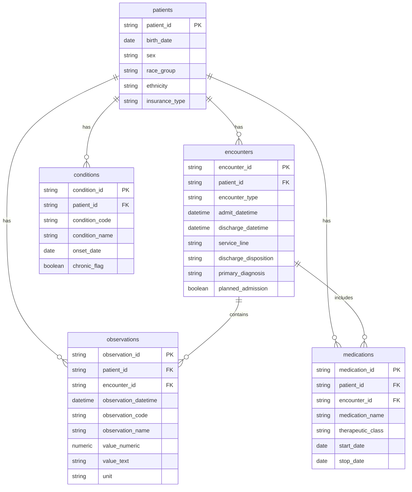

# Data Model

## Source Tables

The raw data layer follows a simplified EHR structure:

## Reporting Layer

Power BI should use the processed tables in `data/processed/`.

Recommended import tables:

- `readmission_features.csv`
- `dashboard_kpis.csv`
- `readmission_summary_by_service.csv`
- `risk_tier_summary.csv`
- `quality_measure_summary.csv`
- `data_quality_summary.csv`
- `operational_flag_summary.csv`
- `cohort_summary_by_age.csv`
- `cohort_summary_by_insurance.csv`
- `feature_importance_proxy.csv`

## Recommended Relationships in Power BI

The simplest dashboard model can use `readmission_features` as the main fact table and keep the aggregate CSV files as independent reporting tables.

If dimensional modeling is preferred, create dimension tables from `readmission_features`:

- `DimServiceLine`: unique `service_line`.
- `DimRiskTier`: unique `risk_tier`.
- `DimAgeGroup`: unique `age_group`.
- `DimInsurance`: unique `insurance_type`.

Then connect each dimension to `readmission_features` with one-to-many relationships.

Recommended manual Power BI setup:

- Keep `readmission_features` disconnected from the summary tables unless you create dedicated dimension tables.
- Use `readmission_features` for slicer-responsive cards and charts.
- Use `quality_measure_summary`, `data_quality_summary`, and `operational_flag_summary` only for Page 2 visuals.
- Use `cohort_summary_by_age` and `cohort_summary_by_insurance` as optional audit tables; for interactive visuals, prefer the DAX measures calculated from `readmission_features`.

## Grain

`readmission_features` is encounter-level. Each row represents one eligible adult inpatient index admission.

The aggregate tables are dashboard-ready summaries and should not be joined back to `readmission_features` unless a specific visual requires it.

## Model Notes

- `patient_id` and `encounter_id` are synthetic identifiers.
- Chronic-condition flags are encounter-level patient history indicators.
- `readmitted_30d` is the primary outcome flag.
- `risk_tier` is a demonstration stratification variable, not a clinically validated risk score.
